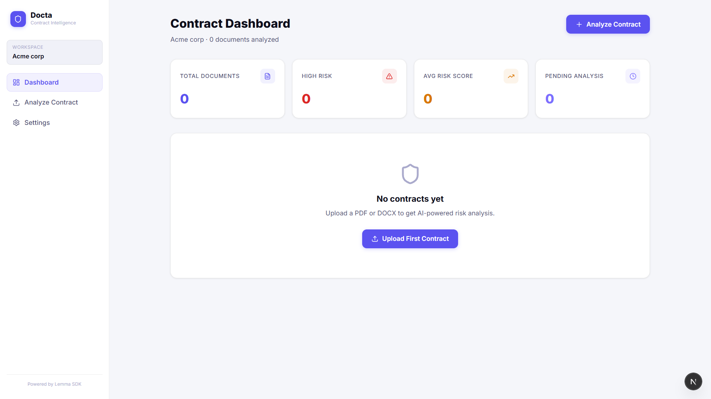

# Docta — AI Contract Intelligence Platform

> Upload a contract. Get risk scores, clause analysis, and negotiation advice in seconds — powered by a 3-agent AI pipeline built on [Lemma SDK](https://lemma.work).

---

## What it does

Docta analyzes legal contracts using three specialized AI agents chained together:

| Agent | Role |
|---|---|
| **Clause Extractor** | Identifies all contract clauses, parties, doc type, and flags missing provisions |
| **Risk Assessor** | Scores each clause for legal risk (0–100), flags red flags, classifies overall risk level |
| **Negotiation Advisor** | Generates negotiation tips and counter-language for every high-risk clause |

The final output is stored in a Lemma datastore and surfaced in a clean dashboard — with per-clause drill-downs, risk rings, and one-click copy of counter-language.

---

## User Interface

- Dashboard

  

---

## Tech Stack

- **Framework** — Next.js 16 (Turbopack)
- **AI Orchestration** — [Lemma SDK](https://lemma.work) (3-agent workflow)
- **PDF Extraction** — `pdf-parse` via child process (bypasses Turbopack bundler)
- **DOCX Extraction** — `mammoth`
- **UI** — Vanilla CSS, Lucide icons
- **Database** — Lemma Datastore (managed, no separate DB needed)
- **Token Persistence** — Vercel KV / Upstash Redis (optional, for production)

---

## Project Structure

```
docta/
├── scripts/
│   ├── refresh-token.cjs    # Runs before dev server — auto-refreshes Lemma auth token
│   ├── extract-text.cjs     # Child process PDF/DOCX extractor (Turbopack-safe)
│   └── seed-kv.cjs          # One-time: seeds Vercel KV with Lemma tokens for production
├── payloads/                # Lemma agent/table/workflow JSON definitions (setup reference)
├── src/
│   ├── app/
│   │   ├── api/
│   │   │   ├── lemma/[...path]/  # Proxy: auto-refreshes tokens, handles 204/SSL
│   │   │   └── extract/          # File extraction API route
│   │   ├── (app)/
│   │   │   ├── dashboard/        # Contract list + metrics
│   │   │   ├── upload/           # Upload + 3-agent pipeline UI
│   │   │   ├── analysis/[id]/    # Per-contract: overview, clauses, negotiation tabs
│   │   │   ├── onboarding/       # First-time org setup
│   │   │   └── settings/         # Org settings
│   │   └── globals.css           # Design system (CSS vars, light theme)
│   ├── components/
│   │   ├── LemmaProvider.tsx     # Auth + org context
│   │   └── ReactQueryProvider.tsx
│   └── lib/
│       └── lemma.ts              # Singleton LemmaClient
```

---

## Setup

### Prerequisites

- Node.js 18+
- [Lemma CLI](https://lemma.work/docs) installed and logged in (`lemma auth login`)
- A Lemma pod with the following configured:

#### Lemma Tables

```bash
lemma tables create documents
lemma tables create analyses
lemma tables create organizations
```

#### Lemma Agents

| Name | Description |
|---|---|
| `clause-extractor` | Extracts clauses, parties, doc type from raw contract text |
| `risk-assessor` | Scores each clause for legal risk |
| `negotiation-advisor` | Generates negotiation advice and counter-language |

#### Lemma Workflow

```
Workflow name: analyze-document
Chain: clause-extractor → risk-assessor → negotiation-advisor
```

> The JSON payloads for all agents, tables, and the workflow are in the `/payloads` directory.

### Environment

Create `.env.local` at the project root (see `.env.example` for the full template):

```env
# Lemma SDK
NEXT_PUBLIC_LEMMA_API_URL=http://localhost:3000/api/lemma
NEXT_PUBLIC_LEMMA_AUTH_URL=https://auth.lemma.work
NEXT_PUBLIC_LEMMA_POD_ID=<your-pod-id>
NEXT_PUBLIC_LEMMA_TOKEN=<token-from-lemma-auth-print-token>
LEMMA_TOKEN=<same-token>
LEMMA_BIN=<path-to-lemma-cli-executable>

# Optional: Vercel KV for production token auto-refresh (see Deployment section)
KV_REST_API_URL=
KV_REST_API_TOKEN=
```

Get your pod ID and initial token:

```bash
lemma pods list
lemma auth print-token
```

### Install & Run

```bash
npm install
npm run dev
```

> **`npm run dev` automatically refreshes the auth token first** via `scripts/refresh-token.cjs` — no manual token updates needed as long as your CLI session is active.

Open [http://localhost:3000](http://localhost:3000).

---

## How It Works

### Upload Flow

```
User uploads PDF/DOCX
        ↓
/api/extract  →  node scripts/extract-text.cjs
        ↓           (child process, outside Turbopack bundler)
  Extracted text
        ↓
lemma.workflows.run('analyze-document')
        ↓
  clause-extractor → risk-assessor → negotiation-advisor
        ↓
  Final output captured from workflow context keys
        ↓
lemma.records.create('documents') + lemma.records.create('analyses')
        ↓
  Redirect to /analysis/{docId}?aid={analysisId}
```

### Auth Proxy

All Lemma SDK requests route through `/api/lemma/[...path]`, which:

- **Local dev** — calls `lemma auth print-token` (JWT expiry-aware, refreshes if <5 min left)
- **Production (KV)** — reads tokens from Vercel KV, calls SuperTokens refresh endpoint, writes new tokens back to KV — fully automatic, indefinite
- Retries on `401` with a fresh token
- Handles `204 No Content` responses (required for DELETE)
- Disables SSL verification for Lemma's self-signed cert

---

## Deployment (Vercel)

### Environment Variables

| Variable | Value |
|---|---|
| `NEXT_PUBLIC_LEMMA_API_URL` | `https://your-app.vercel.app/api/lemma` |
| `NEXT_PUBLIC_LEMMA_AUTH_URL` | `https://auth.lemma.work` |
| `NEXT_PUBLIC_LEMMA_POD_ID` | Your pod ID |
| `NEXT_PUBLIC_LEMMA_TOKEN` | From `lemma auth print-token` |
| `LEMMA_TOKEN` | Same as above |
| `KV_REST_API_URL` | From Vercel KV / Upstash dashboard |
| `KV_REST_API_TOKEN` | From Vercel KV / Upstash dashboard |

### Token Auto-Refresh (Vercel KV)

Without KV, tokens expire every 60 minutes and the app stops working. With KV, it's fully automatic:

**1. Create a KV store** — Vercel Dashboard → Storage → Create KV (or Upstash via Marketplace)

**2. Add `KV_REST_API_URL` and `KV_REST_API_TOKEN` to `.env.local`**

**3. Seed KV with your current refresh token (run once):**

```bash
npm run seed-kv
```

**4. Add the same KV vars to Vercel dashboard and deploy.**

That's it — tokens auto-refresh forever. The only maintenance needed is re-running `seed-kv` after `lemma auth login` if the 30-day session ever expires.

---

## Business Logic

Docta uses **organization-based login**:

- First visit → onboarding creates an org record (stored in `localStorage` + Lemma datastore)
- All subsequent sessions restore from `localStorage`
- No individual user accounts required — the org is the identity unit

---

## Known Limitations

| Issue | Status |
|---|---|
| PDF must be text-based (not scanned/image-only) | Returns 422 with clear error message |
| Multi-user team access | Planned — Settings page has the stub |
| Lemma session expires after ~30 days | Re-run `npm run seed-kv` after `lemma auth login` |

---

## Scripts

| Command | Purpose |
|---|---|
| `npm run dev` | Refresh token + start dev server |
| `npm run build` | Production build |
| `npm run seed-kv` | Seed Vercel KV with current Lemma tokens (run once for production) |
| `node scripts/refresh-token.cjs` | Manually refresh Lemma token in `.env.local` |

---

## License

MIT License - See [LICENSE](./LICENSE.md) file for details
